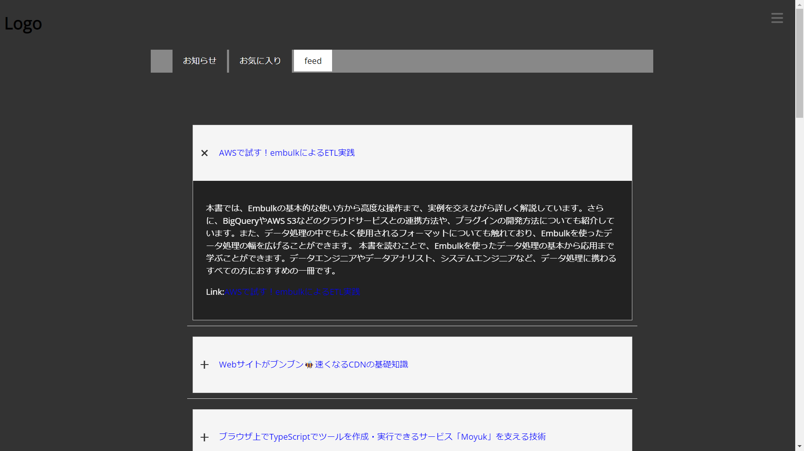
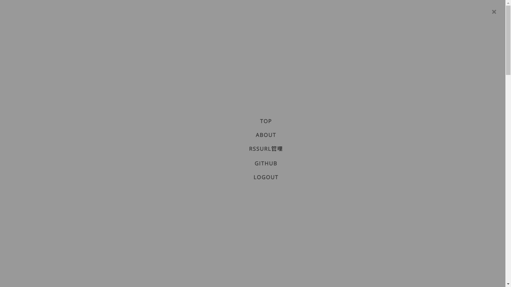

# RssNews
RSSを登録して購読できるweb app (beta ver)

# name

トップページ

メニュー

## Overview
golang/HTML/CSS/javascript/postgresqlを勉強し初めて作成したwebページです.

## Requirement

### langauge
japanese

### os
windows

### database
postgresql

### programming language
golang 
javascript

HTML/CSS

## Usage
動作にはpostgresqlが必要となります.
1.postgresqlにrss_reader_webというデータベースを作成する.
2.main.goを起動

で基本的にシステムは動作します.

## Features
NULL

## Reference
NULL

## Author
NULL